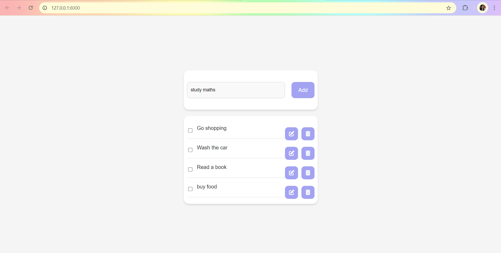
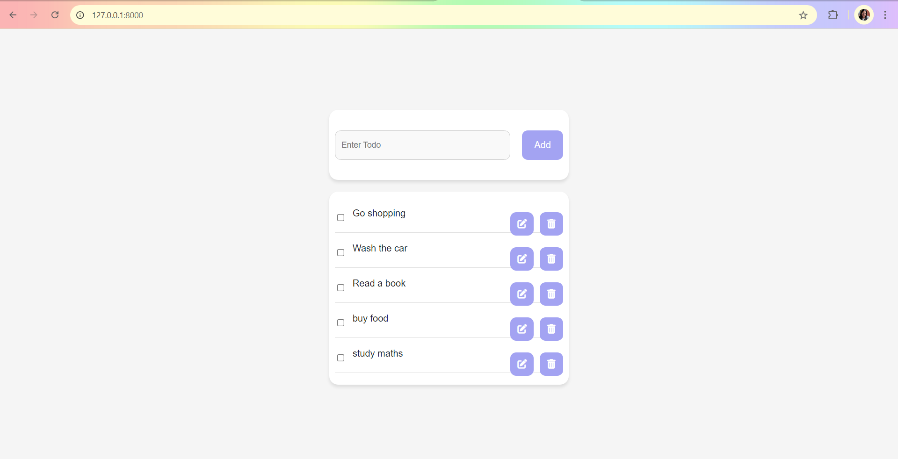
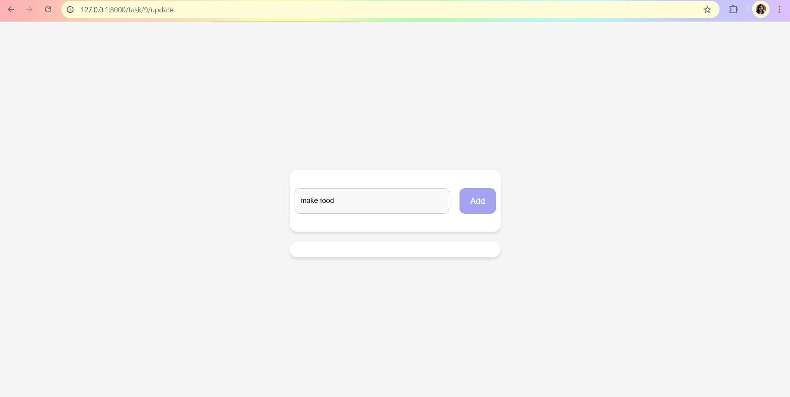
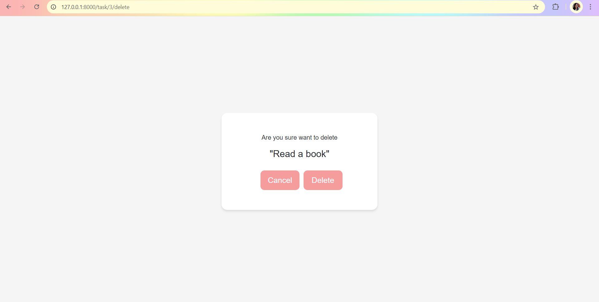
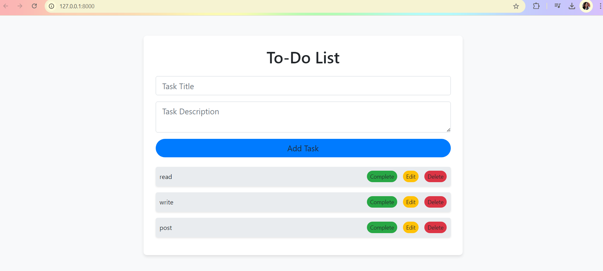

# TodoFlow
TodoFlow is a sleek to-do list app built with Django, offering a clean pastel UI and full CRUD functionality for seamless task management.









TodoFlow is a sleek and user-friendly to-do list application built with Django, featuring a clean pastel UI and full CRUD functionality. Manage your daily tasks with ease and style.

## Features

- **Clean UI**: Soft pastel color scheme for a pleasant user experience.
- **Full CRUD Operations**: Add, edit, delete, and update tasks effortlessly.
- **Responsive Design**: Optimized for all devices.

## Technologies Used

- **Backend**: Django, Django REST Framework
- **Frontend**: HTML, CSS (Bootstrap), JavaScript
- **Database**: MySQL

## Installation

1. Clone the repository:
    ```bash
    git clone https://github.com/yourusername/TodoFlow.git
    ```
2. Navigate to the project directory:
    ```bash
    cd TodoFlow
    ```
3. Create and activate a virtual environment:
    ```bash
    python -m venv venv
    source venv/bin/activate  # On Windows, use `venv\Scripts\activate`
    ```
4. Install dependencies:
    ```bash
    pip install -r requirements.txt
    ```
5. Run migrations:
    ```bash
    python manage.py migrate
    ```
6. Start the development server:
    ```bash
    python manage.py runserver
    ```

## Usage

- Visit `http://127.0.0.1:8000/` in your browser.
- Add, edit, delete, and update tasks to manage your to-do list.

## Contributing

Contributions are welcome! Please fork this repository and submit a pull request for any improvements.

## License

This project is licensed under the MIT License - see the [LICENSE](LICENSE) file for details.


